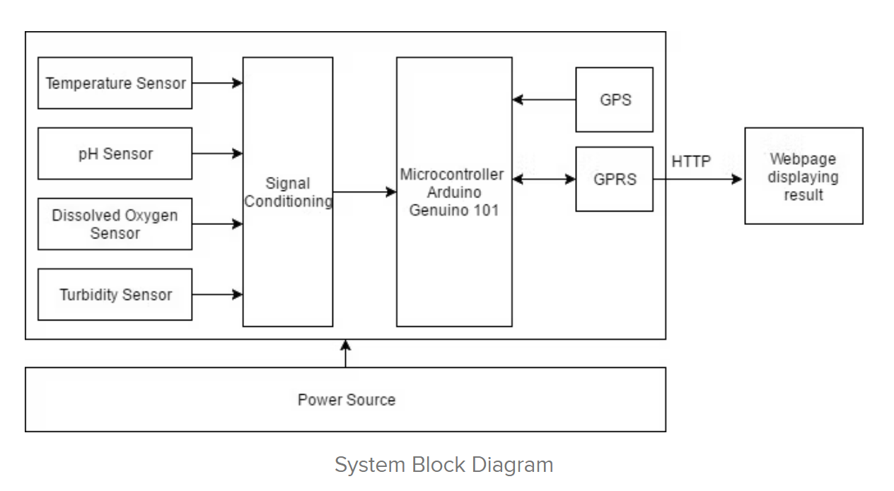

# Water Quality Monitoring System

### About
- In September 2016, a water treatment plant has to be shut down because polluted water flowed into the plant. The water supply company was unable to pin point the contamination source and this caused a serious water service disruption.
- A water quality monitor along with a GPS attached to it will greatly reduce the risk of the entire plant getting contaminated as it can detect the exact location of the source of polluted water.

### Working

- The water quality monitor consists of 4 four sensors i.e. temperature sensor, pH sensor, turbidity sensor and dissolved oxygen sensor and is based on Arduino Uno.
- All the 4 sensors are interfaced to Arduino Genuino 101. Arduino Genuino 101 collects the measurements data periodically, gets the GPS coordinates, and uploads the data bundle into a database using GPRS data link. Users can access the results on the website.
- When any of the values detected by the sensors go beyond the certified limits, it shows a warning.
- The A7 module is used for communication and and it combines both GPRS and GPS in a single package.

### My suggestions
- Along with just displaying a warning on the webpage, we can have systems to automatically shut down and seal off the part of the water plant where the contamination is detected.
