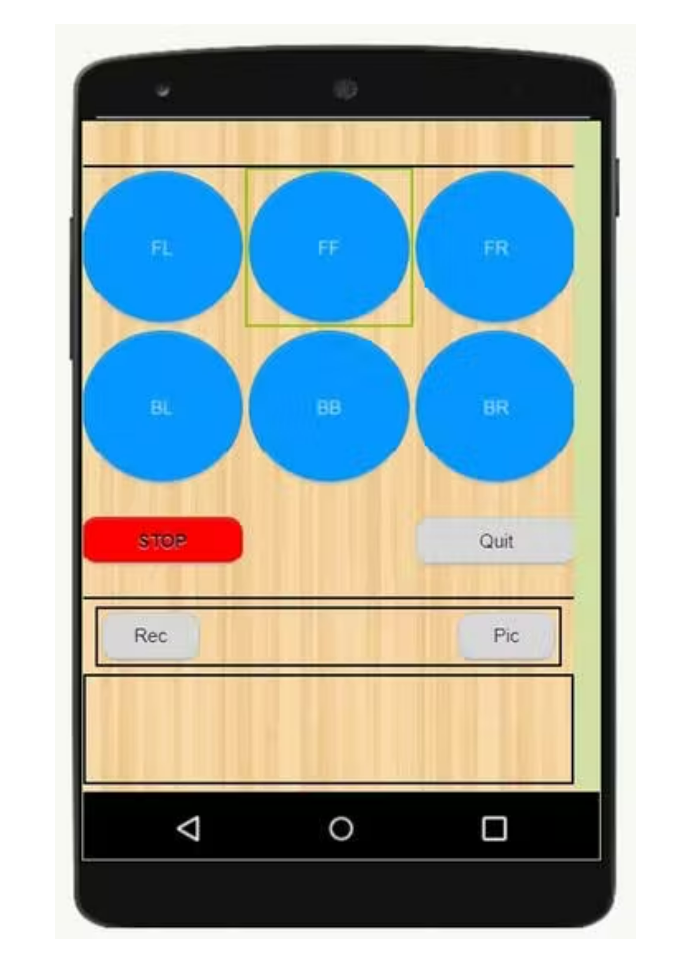

# WeMos D1 Mini Controlling RC Car And Relaying Video Stream

### About
- This project is a RC car controlled via an app in our phone along with a security camera which can record videos or take images.
- We can use this module to survey areas inaccessible to humans.

### Working
- This module uses the WeMos D1 Mini Wi-Fi Development board. 
- The phone (station) automatically connects to the camera (access point) to tell it to become the station and connect to the board.
- An android app will be used to control the movements of the RC car. The app has been built in the MIT App Inventor and 3 extensions are imported namely WebSocketConnector (to control the board), ClientSocketAI2Ext (to control the camera) and TaifunWiFi (to switch betweeb Wi-Fi networks).
- The app has 6 buttons to control the moment, 1 button to stop all movement, 1 button to quit the app, a button to toggle the recording and a button to take a picture.
- The camera used is the SQ13 which is comparatively cheaper then other options. By default, this camera works in Access Point Mode but can be changed to Station Mode until it is powered off.
