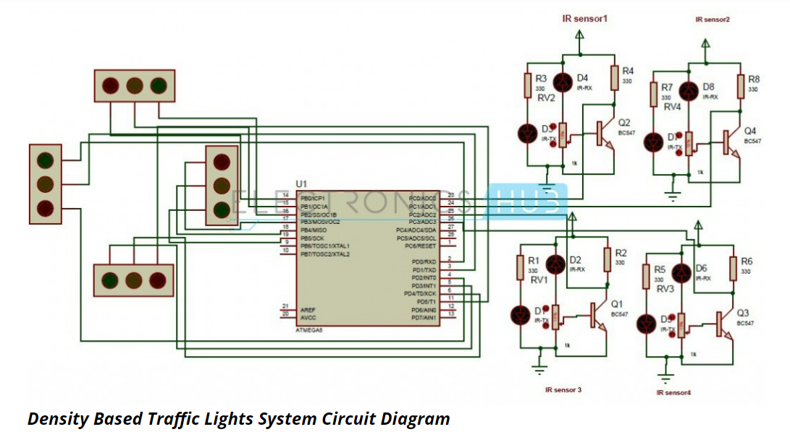

# Density Based Traffic Signal System using Microcontroller

### About
- Nowadays controlling the traffic has become a major issue in every city because of exponential increase in the number of automobiles and time delays between traffic lights.
- In order to rectify this problem, this project has desiged a density based traffic light system.
- The traffic density is measures using IR sensors which inturn are connected to the microcontroller which controls the traffic lights.

### Working
- In this project we use the ATmega8 controller. Along with the controller, we also need 4 IR sensors and 4 traffic lights.
- If there is traffic on the road then that particular IR sensors outputs zero otherwise it outputs 1.
- If a particular IR sensor outputs 0, we have to give green signal to that particular path and give red signal to all others.
- We can allow a time delay of 1 minute for each path.

### Limitations
- Sometimes IR sensors absorb normal light. This can lead to the traffic lights ti function improperly.
- IR sensors can only detect objects at short distances. So in an actual traffic light system, we would have to think of some different way to detect the traffic density.

### Circuit diagram

### My suggestions
- In order to calculate the traffic density, instead of an IR sensor, we can use a normal camera to get a view of the road and using computer vision, we can count the number of cars on the road.
