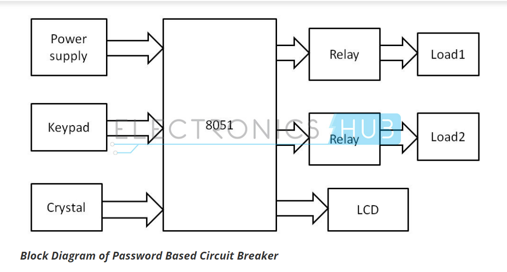

# Password Based Circuit Breaker

### About
- Nowadays there are a lot of accidents on electrical lines when the line man is trying to make repairs.
- To avoid this, this project has developed a curcuit breaker that switches on and off the electrical supply of that particular power line if the correct password is entered.

### Working
- The 8051 microcontroller is used in the circuit. 4x4 keypad is used to enter the password into the system. Each electrical line has a different password.

### Circuit

